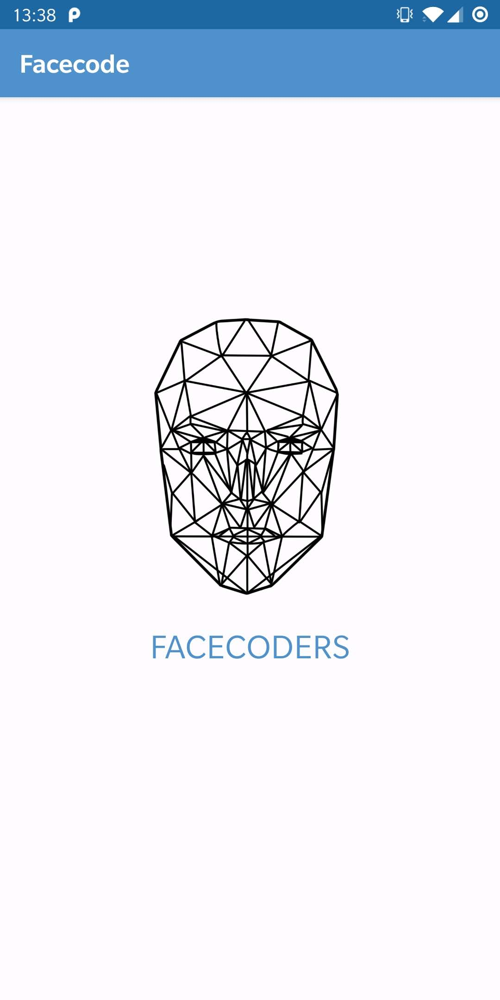
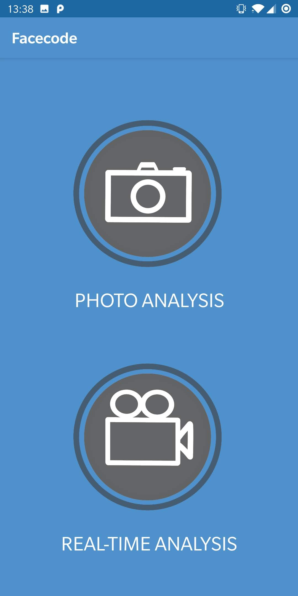
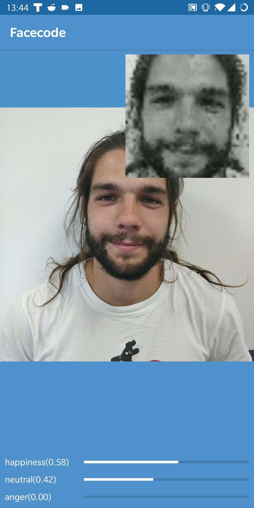
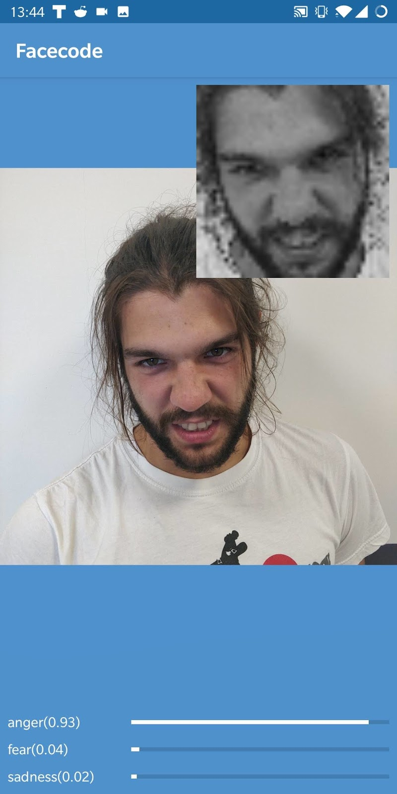
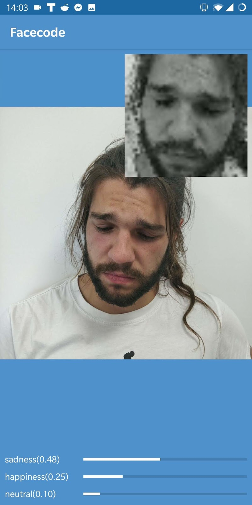
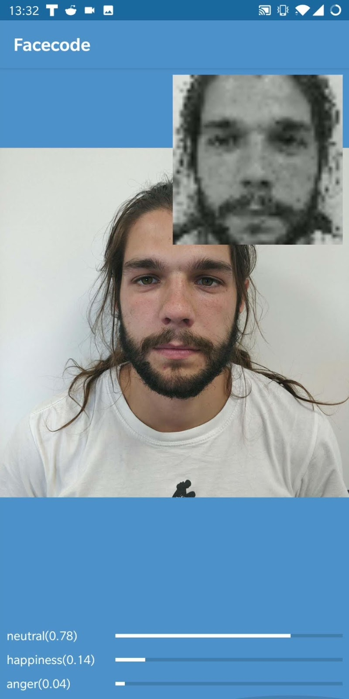
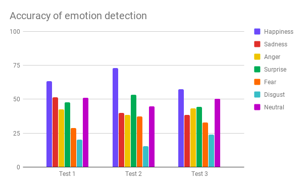

# Facecode
Application that can detect emotions in real time just from camera feedback using deep learning. <br/>
Model has been created in Python using TensorFlow and converted to .tflite format. <br/>
<p align="center">
  
  
</p>
<p align="center">
  
  
  
  
</p>

### Download
All releases of the game are avaliable on the github page in the [releases](https://github.com/msuliborski/facecode/releases) tab. 
Game/App is also avaliable in [Google Play](https://play.google.com/store/apps/details?id=com.sulient.facecode)

## Getting Started
These instructions will get you a copy of the project up and running on your local machine for development and testing purposes. 

### Prerequisites
In order to properly build application one might need to install [Android Studio](https://developer.android.com/studio).

### Cloning
```
$ git clone https://github.com/msuliborski/facecode
```

### Database 
Dataset was downloaded from kaggle website. It is available here: </br>
[Challenges in Representation Learning: Facial Expression Recognition Challenge](https://www.kaggle.com/c/challenges-in-representation-learning-facial-expression-recognition-challenge)

### Model
Trained model is available here:
[app/src/main/assets](app/src/main/assets)

### Building
Open project in Android Studio and install all dependencies needed. Currently project is compatible with Android 10 (SDK 29).

### Usage
Simply run the application and point camera on somebody's face. Detected emotion will be desplayed under camera preview.

## Effectiveness
The chart presents the accuracy for different emotional facial expressions: 
<p align="center">
  
</p>

## Built with
* [Android Studio](https://developer.android.com/studio) - the fastest tools for building apps on every type of Android device.

## Authors
* **Michał Suliborski** - [msuliborski](https://github.com/msuliborski)
* **Anna Preczyńska** - [preczu](https://github.com/preczu)
* **Mariusz Pisarski** - [mariuszpisarski0](https://github.com/mariuszpisarski0)
* **Yura Shcheholiev** - [yurii-shcheholiev](https://github.com/yurii-shcheholiev)

## License
This project is licensed under the MIT License - see the [LICENSE.md](LICENSE.md) file for details
